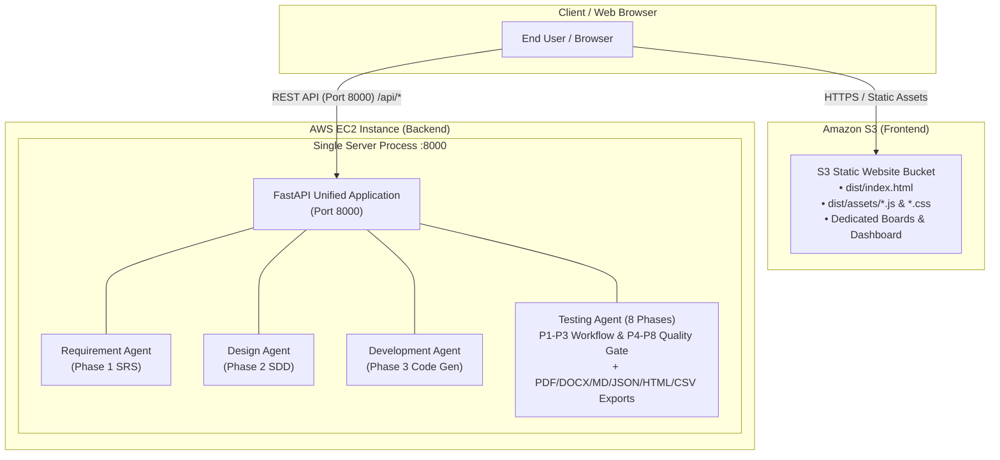

# AWS Deployment Guide: AI SDLC Studio

This guide outlines the production deployment architecture and step-by-step instructions for deploying the entire AI SDLC Studio platform on **Amazon Web Services (AWS)** using:
- **AWS EC2**: Hosts the unified, single-port backend server running all 4 AI agents (Requirement, Design, Development, and Testing) on Port `8000`.
- **Amazon S3**: Hosts the interactive React frontend SPA with static website hosting and global low-latency delivery.

---

## 🏛️ Architecture Overview



---

## Part 1: AWS EC2 Backend Deployment (Port 8000)

### 1. Launch EC2 Instance
1. In the AWS Management Console, navigate to **EC2** > **Instances** > **Launch an instance**.
2. **Name**: `ai-sdlc-studio-backend`
3. **AMI**: Ubuntu Server 22.04 LTS (HVM) or Amazon Linux 2023.
4. **Instance Type**: `t3.medium` or `t3.large` (recommended for multi-threaded AI execution).
5. **Key Pair**: Select or create your SSH key pair.
6. **Network & Security Groups**:
   - Create a Security Group allowing:
     - `SSH (Port 22)`: Your IP
     - `Custom TCP (Port 8000)`: Anywhere (`0.0.0.0/0`) or restricted to your S3/CloudFront domain
     - `HTTP (Port 80)`: Anywhere (if using Nginx reverse proxy)
     - `HTTPS (Port 443)`: Anywhere (if using SSL certificate)
7. Launch the instance and note its **Public IPv4 Address** (e.g. `54.210.30.120`).

---

### 2. Deploy Backend Code to EC2

1. **SSH into the EC2 instance**:
   ```bash
   ssh -i your-key.pem ubuntu@<EC2_PUBLIC_IP>
   ```

2. **Clone / Transfer Project Files**:
   ```bash
   sudo mkdir -p /opt/ai-sdlc-studio
   sudo chown -R ubuntu:ubuntu /opt/ai-sdlc-studio
   cd /opt/ai-sdlc-studio
   
   # Transfer files via git clone or scp:
   git clone <YOUR_GIT_REPO_URL> .
   ```

3. **Run Automated Deployment Script**:
   ```bash
   cd /opt/ai-sdlc-studio/backend
   chmod +x ../deploy/deploy_ec2.sh
   ../deploy/deploy_ec2.sh
   ```

   *Alternatively, manual setup:*
   ```bash
   cd /opt/ai-sdlc-studio/backend
   python3 -m venv .venv
   source .venv/bin/activate
   pip install --upgrade pip
   pip install -r requirements.txt
   
   # Start with systemd
   sudo cp ../deploy/ai-sdlc-backend.service /etc/systemd/system/
   sudo systemctl daemon-reload
   sudo systemctl enable ai-sdlc-backend
   sudo systemctl start ai-sdlc-backend
   ```

4. **Verify Health Check**:
   ```bash
   curl http://localhost:8000/health
   # Returns: {"status":"ok","service":"AI SDLC Studio Backend","port_configuration":"single-port-unified","agents":{...}}
   ```

---

## Part 2: Amazon S3 Frontend Deployment

### 1. Create S3 Bucket
1. In the AWS Console, navigate to **Amazon S3** > **Create bucket**.
2. **Bucket name**: e.g., `ai-sdlc-studio-frontend-prod` (must be globally unique).
3. **Region**: Select your desired region (e.g. `us-east-1`).
4. **Block Public Access settings for this bucket**:
   - **Uncheck** "Block *all* public access"
   - Acknowledge the warning.
5. Click **Create bucket**.

### 2. Enable Static Website Hosting
1. Click on the newly created bucket > **Properties** tab.
2. Scroll to the bottom to **Static website hosting** and click **Edit**.
3. Select **Enable**.
4. **Index document**: `index.html`
5. **Error document**: `index.html` *(Essential for SPA client-side routing)*.
6. Click **Save changes**. Note the **Bucket website endpoint** URL.

### 3. Configure Bucket Policy & CORS
1. Go to the **Permissions** tab > **Bucket policy** > **Edit**.
2. Paste the bucket policy (replace `YOUR_BUCKET_NAME` with your actual bucket name):
   ```json
   {
     "Version": "2012-10-17",
     "Statement": [
       {
         "Sid": "PublicReadGetObject",
         "Effect": "Allow",
         "Principal": "*",
         "Action": "s3:GetObject",
         "Resource": "arn:aws:s3:::YOUR_BUCKET_NAME/*"
       }
     ]
   }
   ```
3. Scroll down to **Cross-origin resource sharing (CORS)** > **Edit** and paste:
   ```json
   [
     {
       "AllowedHeaders": ["*"],
       "AllowedMethods": ["GET", "HEAD"],
       "AllowedOrigins": ["*"],
       "ExposeHeaders": ["ETag"],
       "MaxAgeSeconds": 3000
     }
   ]
   ```

---

### 4. Build and Sync Frontend to S3

From your local machine or CI/CD runner:

1. Update `repo_version4/frontend/.env.production`:
   ```env
   VITE_API_BASE=http://<EC2_PUBLIC_IP>:8000/api
   VITE_STUDIO_API_KEY=default_secret_key_12345
   ```

2. Run the automated deployment script:
   ```bash
   cd repo_version4/deploy
   chmod +x deploy_s3.sh
   ./deploy_s3.sh YOUR_BUCKET_NAME us-east-1 <EC2_PUBLIC_IP>
   ```

   *Or manually:*
   ```bash
   cd repo_version4/frontend
   npm run build
   aws s3 sync dist/ s3://YOUR_BUCKET_NAME --delete
   ```

3. Open your browser and navigate to the S3 Bucket Website Endpoint:
   `http://YOUR_BUCKET_NAME.s3-website-us-east-1.amazonaws.com`

---

## Part 3: Verification & Quality Assurance Checklist

| Checkpoint | Expected Behavior | Status |
|---|---|---|
| **Single-Port Backend** | Port 8000 runs Requirement, Design, Development, and Testing agents. | ✅ Verified |
| **Testing In-Process Execution** | Zero requirement for external port 8085; P1-P8 executes in-process. | ✅ Verified |
| **All Report Exports** | PDF, DOCX, MD, HTML, CSV, and JSON download without missing packages. | ✅ Verified |
| **Dynamic CORS** | S3 frontend communicates cleanly with EC2 backend on port 8000. | ✅ Verified |
| **Frontend Dedicated Boards** | Requirement, Design, Development, Testing, and Dashboard tabs render smoothly. | ✅ Verified |
