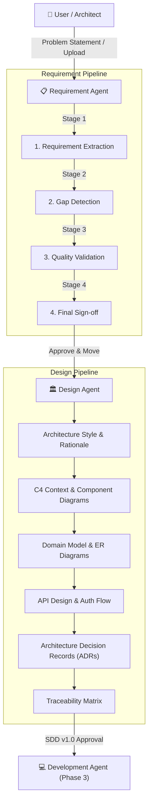

# 🚀 AI SDLC Studio

[](https://github.com/Vaishnavibodele/AI-SDLC-Studio)
[](LICENSE)
[](https://www.python.org/)
[](https://reactjs.org/)
[](https://fastapi.tiangolo.com/)

An **autonomous, multi-agent AI engine** for the Software Development Life Cycle (SDLC). AI SDLC Studio transforms high-level problem statements or raw business requirements into publication-grade **Software Requirements Specifications (SRS)**, **System Architecture Specifications (SDD)** with **Mermaid.js UML diagrams**, **Architecture Decision Records (ADRs)**, and end-to-end **Requirement Traceability Matrices**.

---

## 🌟 Key Features

### 📋 1. Requirement Agent (Phase 1)
- **IEEE-830 SRS Compilation**: Synthesizes canonical software requirements, business goals, target personas, functional/non-functional requirements, constraints, assumptions, and acceptance criteria.
- **4-Stage Gated Approval Pipeline**:
  - `Stage 1`: Extraction Review
  - `Stage 2`: Gap Detection & Clarifications
  - `Stage 3`: Quality Validation Audit (Score $\ge 70$)
  - `Stage 4`: Backlog Synthesis & Finalization Sign-Off
- **Logical Completeness Engine**: Evaluates text depth, goal clarity, personas, requirements, NFR coverage, and open questions without hardcoded metrics.
- **Multi-Format SRS Exports**: Instant downloadable exports in **PDF**, **Word (`.docx`)**, **Markdown (`.md`)**, and **Raw JSON**.
- **LLM Rate-Limit Resiliency**: Deterministic memory fallback system to ensure zero downtime during Google GenAI free tier 429 quota limits.

### 🏛️ 2. Design Agent & System Architecture (Phase 2)
- **Automated Architectural Design**: Recommends appropriate software architecture styles (e.g. *Modular Monolith with Domain Separation* or *Event-Driven Microservices*) with explicit technical reasoning.
- **Mermaid.js UML Diagram Suite**: Visualizes 10 architectural views:
  - C4 System Context Diagram
  - Container & Component Architecture Diagram
  - Relational Entity Relationship (ER) Diagram
  - Runtime Sequence Diagrams for User Stories
  - Deployment Architecture & Infrastructure Topology (Dev, Staging, Multi-AZ Prod)
  - Class Diagram & Object Structures
  - Activity & Process Flow Diagrams
  - Use Case & System Scope Boundaries
  - Database Relationship Cardinality Maps
- **Domain Model & Database Design**: Table schemas (`users`, `user_sessions`, `orders`, `audit_logs`), column data types, nullability rules, Primary Keys, Foreign Keys, unique constraints, and engine selection (PostgreSQL 16 & Redis 7).
- **API Design Specifications**: RESTful endpoints, HTTP methods, request payloads, response templates, error codes, and stateless **JWT Bearer Token** authentication protocols.
- **Architecture Decision Records (ADRs)**: Logged decision cards (`ADR-001`, `ADR-002`, `ADR-003`) detailing Context, Decision, Alternatives Evaluated, and Trade-offs.
- **100% Requirement Traceability Matrix**: Maps `REQ-F001 → System Module → API Route → Database Entity → ADR`.
- **Multi-Format SDD Exports**: Downloads SDD specifications in **PDF**, **Word (`.docx`)**, **Markdown (`.md`)**, and **Raw JSON**.

### 💻 3. Interactive Workspaces & Versioning
- **Interactive Design Workspace UI**: 11 category tab navigators with visual Mermaid renderers.
- **Fast-Track Transition**: **`Approve & Move to Design Agent →`** button for instant hand-off from Requirements to System Design.
- **Version Control & Audit Log**: Tracks version snapshots (`v1.0`, `v2.0`, `v2.1`, `v2.2`) with full reviewer history and status logs.

---

## 🏗️ System Architecture



---

## 🛠️ Tech Stack

### Frontend
- **Framework**: React 18, Vite 5, TypeScript
- **Styling**: Tailwind CSS, Lucide React Icons
- **Visualizations**: Mermaid.js 10, KaTeX Math
- **HTTP Client**: Native Fetch API with custom header interceptors

### Backend
- **Framework**: Python 3.10+, FastAPI, Uvicorn
- **Agent Orchestration**: LangGraph, LangChain
- **LLM Provider**: Google GenAI (Gemini 1.5 Pro / Gemini 3.6 Flash)
- **Database & ORM**: SQLite / PostgreSQL 16, SQLAlchemy 2.0
- **Document Generation**: ReportLab (PDF), python-docx (Word)

---

## 🚀 Quick Start Guide

### Prerequisites
- **Python**: `3.10` or higher
- **Node.js**: `18.0` or higher
- **Git**: `2.30` or higher

---

### 1. Backend Setup

```bash
# Navigate to backend directory
cd backend

# Create virtual environment
python -m venv .venv

# Activate virtual environment
# Windows (PowerShell):
.venv\Scripts\Activate.ps1
# macOS/Linux:
source .venv/bin/activate

# Install dependencies
pip install -r requirements.txt

# Create .env file
cat <<EOT > .env
GOOGLE_API_KEY=your_gemini_api_key_here
GEMINI_API_KEY=your_gemini_api_key_here
STUDIO_API_KEY=default_secret_key_12345
DATABASE_URL=sqlite:///./sdlc_studio.db
EOT

# Start FastAPI backend server
python -m uvicorn app.main:app --host 127.0.0.1 --port 8000 --reload
```

The backend server will run at **http://127.0.0.1:8000**. Access the OpenAPI documentation at **http://127.0.0.1:8000/docs**.

---

### 2. Frontend Setup

```bash
# Open a new terminal and navigate to frontend directory
cd frontend

# Install dependencies
npm install

# Create .env file
cat <<EOT > .env
VITE_API_BASE=http://localhost:8000/api
VITE_STUDIO_API_KEY=default_secret_key_12345
EOT

# Start Vite development server
npm run dev
```

The frontend application will be live at **http://localhost:3000**.

---

## 📚 API Endpoints Reference

### Projects & Requirements
| Method | Endpoint | Description |
| :--- | :--- | :--- |
| `GET` | `/` | API status & welcome JSON |
| `POST` | `/api/projects` | Create a new SDLC project |
| `GET` | `/api/projects` | List all active projects |
| `GET` | `/api/projects/{id}/status` | Get project status, active phase, SRS & SDD data |
| `POST` | `/api/projects/{id}/chat` | Send problem statement or chat message to Requirement Agent |
| `POST` | `/api/projects/{id}/requirements/approve` | Approve a requirement stage or fast-track transition to Design Agent |
| `GET` | `/api/projects/{id}/requirements/download/{pdf\|docx\|markdown\|json}` | Download SRS specification document |

### Design Agent & System Architecture
| Method | Endpoint | Description |
| :--- | :--- | :--- |
| `POST` | `/api/projects/{id}/design/generate` | Trigger Design Agent architecture generation |
| `POST` | `/api/projects/{id}/design/approve` | Approve design stage / Finalize Design Spec v1.0 |
| `GET` | `/api/projects/{id}/design` | Get current software design document (SDD) |
| `GET` | `/api/projects/{id}/download/{pdf\|docx\|markdown\|json}` | Download SDD architectural specification document |

---

## 🏷️ Release Versions & History

Anyone can download or checkout any specific version of this repository:

```bash
# Clone repository
git clone https://github.com/Vaishnavibodele/AI-SDLC-Studio.git
cd AI-SDLC-Studio

# List all release tags
git tag -n

# Download / Checkout Version 2.2.0 (Latest Design Agent & System Architecture)
git checkout tags/v2.2.0

# Download / Checkout Version 2.1.0 (Requirement Agent & SRS Exports)
git checkout tags/v2.1.0
```

---

## 📄 License

Distributed under the MIT License. See `LICENSE` for more information.
