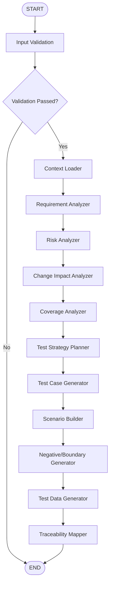

# Smart Building Monitoring System — Testing Agent Foundation

The **Testing Agent** acts as an intelligent quality gate in the multi-agent AI Software Development Life Cycle (SDLC) Assistant. It sits between the Development Agent and the Deployment Agent to ensure developed code aligns with the Software Requirements Specification (SRS) and Software Design Document (SDD).

## SDLC Architecture Role

```text
Requirement Agent ➔ Approved SRS
       ↓
  Design Agent    ➔ Approved SDD
       ↓
Development Agent ➔ Approved Developed Code
       ↓
  Testing Agent   ➔ Quality Gate Verification (This Service)
       ↓
 Human Approval
       ↓
Deployment Agent  ➔ Production Rollout
```

---

## Workflow Architecture

The workflow is orchestrated using **LangGraph**. It sequentially executes input validation, context loading, and testing intelligence reasoning:



---

## Project Structure

```text
testing-agent/
│
├── app/
│   ├── main.py                     # FastAPI application startup & entrypoint
│   │
│   ├── agents/
│   │   ├── input_validator.py      # Node: Input Validation
│   │   ├── context_loader.py       # Node: Context Normalizer
│   │   ├── requirement_analyzer.py # Node: Requirement Extractor
│   │   ├── risk_analyzer.py        # Node: System Risk Assessor
│   │   ├── impact_analyzer.py      # Node: Regression Impact Analyzer
│   │   ├── coverage_analyzer.py    # Node: Ingestion/Requirement Coverage
│   │   ├── strategy_planner.py     # Node: Test Strategy Planner
│   │   ├── test_case_generator.py  # Node: Test Case Generator (Phase 3)
│   │   ├── scenario_builder.py     # Node: Scenario Builder (Phase 3)
│   │   ├── negative_boundary_generator.py # Node: Negative/Boundary Generator (Phase 3)
│   │   ├── test_data_generator.py  # Node: Test Data Generator (Phase 3)
│   │   └── traceability_mapper.py  # Node: Traceability Mapper (Phase 3)
│   │
│   ├── api/
│   │   └── testing.py              # API Endpoint: /testing/start
│   │
│   ├── workflow/
│   │   └── testing_workflow.py     # LangGraph workflow structure
│   │
│   ├── models/
│   │   ├── state.py                # LangGraph state schema (TestingState)
│   │   └── schemas.py              # Pydantic HTTP request/response schemas
│   │
│   └── services/
│       ├── llm.py                  # GeminiService using google-genai SDK
│       └── test_design_validator.py # Phase 3 validation & traceability logic
│
├── frontend/                       # Canonical dashboard (Phase 3 UI)
│   ├── index.html
│   ├── app.js
│   ├── style.css
│   └── server.py                   # Static server + /api/* proxy → backend :8085
│
├── tests/
│   ├── test_validation.py          # Validator unit tests
│   ├── test_intelligence.py        # Intelligence nodes unit tests
│   ├── test_test_design.py         # Phase 3 test design node & validator tests
│   └── test_workflow.py            # LangGraph workflow & API integration tests
│
├── requirements.txt                # Dependency specifications
├── .env.example                    # Environmental configuration template
└── README.md                       # Documentation
```

---

## Configuration

We use environment variables to explicitly toggle execution modes.

Create a `.env` file in the `testing-agent/` directory:

```bash
LLM_MODE=mock       # Set to 'gemini' for real API execution, or 'mock' for deterministic local runs
GEMINI_API_KEY=     # Required if LLM_MODE=gemini (the agent fails if set to gemini and key is missing)
```

---

## Installation & Setup

### 1. Create Virtual Environment
Create a virtual environment within the `testing-agent` directory:
```bash
python -m venv .venv
```

### 2. Activate Virtual Environment
* **Windows (PowerShell)**:
  ```powershell
  .\.venv\Scripts\Activate.ps1
  ```
* **macOS/Linux**:
  ```bash
  source .venv/bin/activate
  ```

### 3. Install Dependencies
```bash
pip install -r requirements.txt
```

---

## How to Run

### Run FastAPI Server
Start the Uvicorn development server:
```bash
uvicorn app.main:app --reload --port 8085
```
Open your browser and navigate to http://127.0.0.1:8085/docs to explore the interactive Swagger UI.

### Run Tests
To run unit and integration tests:
```bash
pytest -v
```

---

## Phases

### Phase 1 — Input Validation & Context Loading
Validates the required project artifacts (`project_id`, `srs`, `sdd`, `source_code`) and normalizes them into a structured testing context consumed by the intelligence pipeline.

### Phase 2 — Testing Intelligence
Runs the analysis pipeline (Requirements, Risks, Change Impact, Coverage, Test Strategy) using the Gemini LLM (or deterministic mocks) and returns an `intelligence` summary.

### Phase 3 — Test Design (Implemented)
- **Test Case Generator** — Produces structured positive/happy-path/core test case specifications.
- **Scenario Builder** — Builds end-to-end business flow scenarios linked to requirements and test cases.
- **Negative/Boundary Generator** — Adds negative, boundary, and edge test case specifications.
- **Test Data Generator** — Generates structured test data records linked to test cases.
- **Traceability Mapper** — Deterministically builds `Requirement → Risk → Design → Code → Scenario → Test Case → Test Data` traceability chains, reporting uncovered requirements and orphaned artifacts.
- **Output Container:** `test_design` in the API response:
  ```json
  {
    "test_cases": [],
    "test_scenarios": [],
    "generated_test_data": [],
    "traceability": {},
    "warnings": []
  }
  ```
- **Frontend Dashboard:** The canonical dashboard (`testing-agent/frontend/`) renders real Phase 3 output via four result tabs — **Test Cases** (with type/priority/category filters), **Scenarios**, **Test Data**, and **Traceability** — and lights up the `TESTS` workflow node on completion.
- **Knobs:** `MAX_TEST_CASES` (default 50) caps the generated test case count; `LLM_MODE=mock` returns high-fidelity deterministic fixtures.

> Phase 4 (execution of the generated tests) is not yet implemented.

---

## Example API Request / Response

### Endpoint
`POST /testing/start`

### Request Payload (Valid)
```json
{
  "project_id": "smart-building-001",
  "srs": {
    "title": "Smart Building SRS",
    "version": "1.0",
    "features": [
      "Real-time temperature telemetry collection",
      "HVAC automated threshold alerts"
    ]
  },
  "sdd": {
    "architecture": "Event-driven architecture",
    "components": [
      "Telemetry Collector",
      "Alert Notification Engine"
    ]
  },
  "source_code": {
    "repository": "github.com/org/smart-building",
    "language": "Python",
    "files": ["main.py", "telemetry.py", "alerts.py"],
    "changes": {
      "changed_files": ["telemetry.py"],
      "changed_functions": ["process_reading"]
    }
  },
  "api_docs": {
    "base_url": "https://api.smartbuilding.com"
  },
  "database_schema": {
    "dialect": "PostgreSQL",
    "tables": ["telemetry", "alerts"]
  },
  "test_data": {},
  "environment": {
    "name": "staging"
  }
}
```

### Successful Response
```json
{
  "project_id": "smart-building-001",
  "validation_status": "passed",
  "validation_errors": [],
  "workflow_status": "completed",
  "intelligence": {
    "requirements": [
      {
        "id": "REQ-001",
        "description": "The system must process real-time room temperature and telemetry readings.",
        "category": "Functional",
        "source": "srs"
      },
      {
        "id": "REQ-002",
        "description": "Trigger automated alerts when device readings exceed configurable thresholds.",
        "category": "Functional",
        "source": "srs"
      },
      {
        "id": "REQ-003",
        "description": "State telemetry collector must be isolated as an independent microservice.",
        "category": "Functional",
        "source": "sdd"
      }
    ],
    "risks": [
      {
        "risk_id": "RSK-001",
        "requirement_id": "REQ-001",
        "description": "High frequency data bursts from sensor devices may overflow DB buffer size.",
        "severity": "Medium",
        "likelihood": "Low",
        "mitigation": "Write high-load mock telemetries to verify buffer queue overflows.",
        "source": "ai_inference"
      },
      {
        "risk_id": "RSK-002",
        "requirement_id": "REQ-002",
        "description": "HVAC threshold alerts delayed due to async notification processing bottlenecks.",
        "severity": "High",
        "likelihood": "Medium",
        "mitigation": "Simulate network delay and measure alert generation latency SLA.",
        "source": "ai_inference"
      }
    ],
    "change_impact": {
      "has_changes": true,
      "changed_files": [
        "telemetry.py"
      ],
      "changed_functions": [
        "process_reading"
      ],
      "impacted_requirements": [
        "REQ-001"
      ],
      "regression_risk": "Medium",
      "message": "Modification inside parse_sensor_reading impacts telemetry ingestion (REQ-001). Code updates could fail ingestion logic.",
      "source": "source_code"
    },
    "coverage": {
      "mapped_requirements": [
        "REQ-001",
        "REQ-002"
      ],
      "uncovered_requirements": [
        "REQ-003"
      ],
      "coverage_percentage": 66.7,
      "source": "ai_inference"
    },
    "test_strategy": {
      "unit_tests": [
        "Verify parse_sensor_reading parser rejects invalid hex keys.",
        "Verify AlertTrigger evaluates boundary thresholds."
      ],
      "integration_tests": [
        "Ensure telemetry collector routes alerts to notifier dispatch queue."
      ],
      "api_tests": [
        "Check POST /telemetry accepts Pydantic requests.",
        "Test GET /alerts filter options."
      ],
      "tools": [
        "pytest",
        "httpx"
      ],
      "environments": [
        "staging"
      ],
      "source": "ai_inference"
    }
  }
}
```

### Validation Failure Response (Intelligence omitted)
```json
{
  "project_id": "smart-building-001",
  "validation_status": "failed",
  "validation_errors": [
    "srs cannot be empty"
  ],
  "workflow_status": "failed",
  "intelligence": null
}
```
